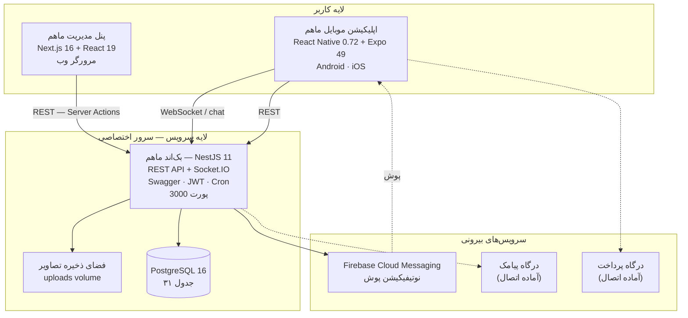
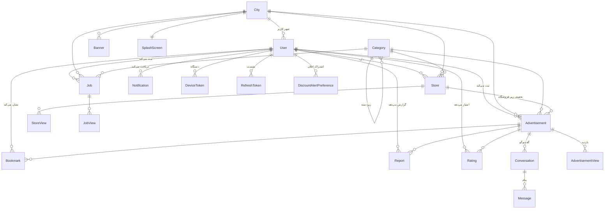
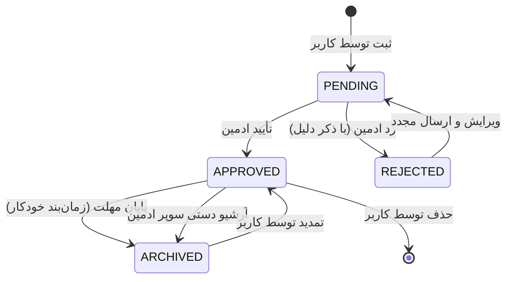
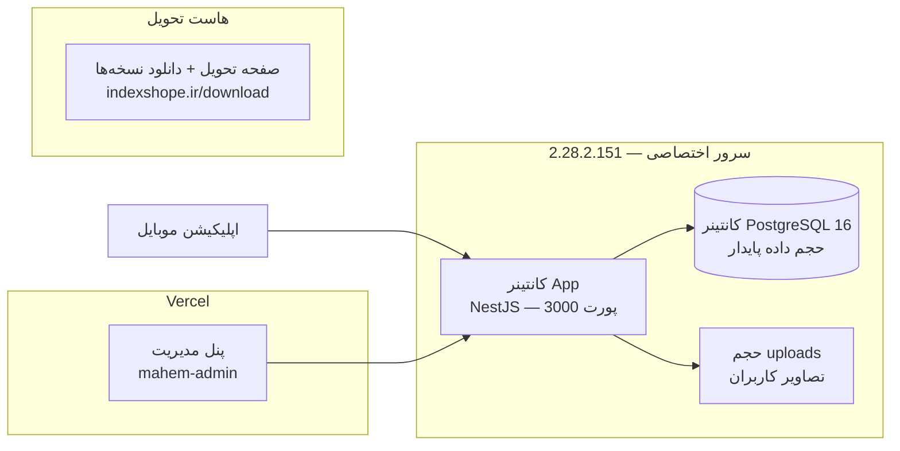
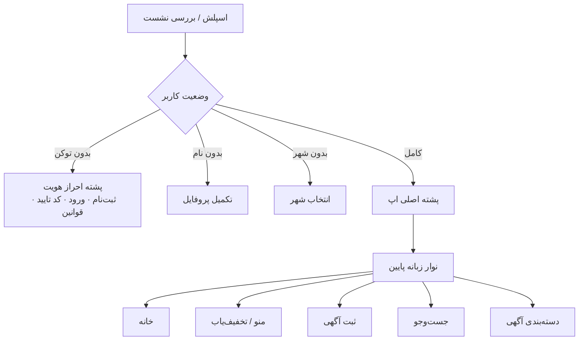
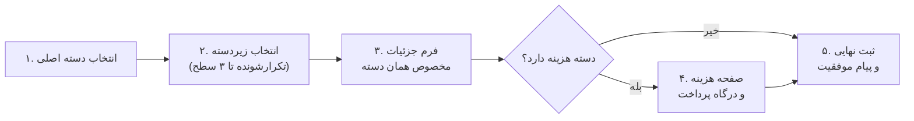
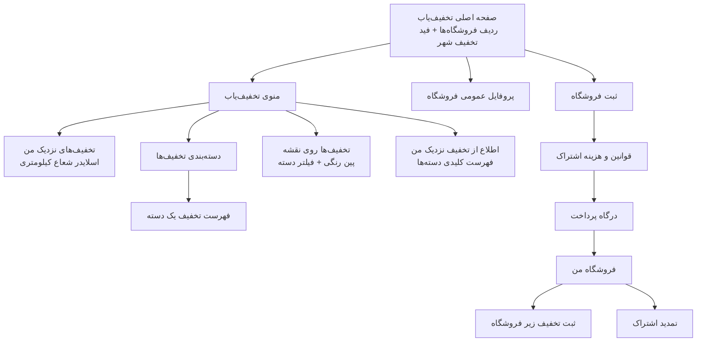

# گزارش جامع پروژه «ماهم»

### مستند تحویل فاز Inception و فاز Elaboration

| | |
|---|---|
| **نام پروژه** | ماهم (Mahem) — سامانه نیازمندی‌ها، بانک مشاغل و تخفیف‌یاب استان گلستان |
| **نسخه مستند** | ۱٫۰ |
| **تاریخ تدوین** | ۱۴۰۵/۰۵/۰۷ (2026-07-29) |
| **نسخه نرم‌افزار** | اپلیکیشن موبایل v1.0.0 · بک‌اند v1.0 · پنل مدیریت v0.1 |
| **وضعیت** | تحویل نسخه اول قابل بهره‌برداری (Beta / Release Candidate) |
| **مخاطب** | کارفرما / تیم بهره‌بردار |

---

## فهرست مطالب

**بخش اول — فاز Inception**
1. [خلاصه مدیریتی](#۱-خلاصه-مدیریتی)
2. [چشم‌انداز محصول (Vision)](#۲-چشم‌انداز-محصول-vision)
3. [ذی‌نفعان و کنشگران سیستم (Actors)](#۳-ذی‌نفعان-و-کنشگران-سیستم-actors)
4. [دامنه و محدوده پروژه (Scope)](#۴-دامنه-و-محدوده-پروژه-scope)
5. [فهرست موارد کاربری سطح بالا (Use-Case Survey)](#۵-فهرست-موارد-کاربری-سطح-بالا-use-case-survey)
6. [ریسک‌ها، مفروضات و محدودیت‌ها](#۶-ریسک‌ها-مفروضات-و-محدودیت‌ها)

**بخش دوم — فاز Elaboration**

7. [معماری کلان سیستم](#۷-معماری-کلان-سیستم)
8. [مدل دامنه و پایگاه داده](#۸-مدل-دامنه-و-پایگاه-داده)
9. [معماری استقرار (Deployment)](#۹-معماری-استقرار-deployment)
10. [تصمیمات معماری کلیدی](#۱۰-تصمیمات-معماری-کلیدی)

**بخش سوم — شرح تفصیلی قابلیت‌ها**

11. [اپلیکیشن موبایل — شرح کامل فیچرها](#۱۱-اپلیکیشن-موبایل--شرح-کامل-فیچرها)
12. [پنل مدیریت — شرح کامل فیچرها](#۱۲-پنل-مدیریت--شرح-کامل-فیچرها)
13. [سرویس‌های سمت سرور و APIها](#۱۳-سرویس‌های-سمت-سرور-و-apiها)

**بخش چهارم — پیوست‌ها**

14. [ماتریس ردیابی طراحی فیگما ↔ پیاده‌سازی](#۱۴-ماتریس-ردیابی-طراحی-فیگما--پیاده‌سازی)
15. [کیفیت، امنیت و تست](#۱۵-کیفیت-امنیت-و-تست)
16. [موارد باقی‌مانده و پیشنهادهای فاز بعد](#۱۶-موارد-باقی‌مانده-و-پیشنهادهای-فاز-بعد)
17. [اطلاعات تحویل و دسترسی‌ها](#۱۷-اطلاعات-تحویل-و-دسترسی‌ها)

---
---

# بخش اول — فاز Inception

## ۱. خلاصه مدیریتی

«ماهم» یک پلتفرم بومی نیازمندی‌ها و کسب‌وکارهای محلی است که به‌طور اختصاصی برای شهرها و بخش‌های **استان گلستان** طراحی و پیاده‌سازی شده است. برخلاف سامانه‌های سراسری، ماهم محتوای خود را بر پایه‌ی **شهر** سازمان می‌دهد؛ کاربر شهر خود را انتخاب می‌کند و از آن پس تمام آگهی‌ها، مشاغل، تخفیف‌ها، بنرها و حتی تصویر اسپلش برنامه متناسب با همان شهر نمایش داده می‌شود.

محصول از **سه سامانه‌ی مستقل و یکپارچه** تشکیل شده است:

| سامانه | فناوری | نقش |
|---|---|---|
| **اپلیکیشن موبایل ماهم** | React Native 0.72 + Expo 49 (Android / iOS) | رابط کاربر نهایی — ۵۱ صفحه |
| **بک‌اند ماهم** | NestJS 11 + Prisma 7 + PostgreSQL 16 | منطق کسب‌وکار، داده، احراز هویت، چت بلادرنگ، پوش — ۱۲۵ اندپوینت |
| **پنل مدیریت ماهم** | Next.js 16 + React 19 + Tailwind 4 | مدیریت محتوا، تأیید آگهی، آمار — ۲۰ بخش مدیریتی |

**چهار سرویس اصلی محصول:**

1. **آگهی و نیازمندی‌ها** — ثبت، جست‌وجو، فیلتر پیشرفته و مشاهده آگهی در ۱۰ دسته‌ی اصلی و تا سه سطح زیردسته.
2. **بانک مشاغل** — دایرکتوری کسب‌وکارهای شهر در ۲۰ صنف، با پروفایل کامل (لوگو، بنر، تلفن، آدرس، موقعیت روی نقشه، شبکه‌های اجتماعی).
3. **تخفیف‌یاب** — سامانه‌ی کشف تخفیف‌های محلی شامل فید تخفیف، نقشه‌ی تخفیف‌ها، «تخفیف نزدیک من» با شعاع قابل تنظیم، اطلاع‌رسانی پوش بر اساس موقعیت، و **فروشگاه‌های اشتراکی** برای کسب‌وکارها.
4. **چت و تعامل** — گفت‌وگوی بلادرنگ خریدار و فروشنده روی هر آگهی، نشان‌کردن آگهی، امتیازدهی، گزارش تخلف و اشتراک‌گذاری.

در زمان تدوین این مستند، هر سه سامانه پیاده‌سازی، یکپارچه و روی سرور اختصاصی مستقر شده‌اند و نسخه‌های نصبی Android (APK) و iOS (IPA) در اختیار کارفرما قرار گرفته است.

---

## ۲. چشم‌انداز محصول (Vision)

### ۲٫۱ بیان مسئله

| مؤلفه | شرح |
|---|---|
| **مسئله** | سامانه‌های سراسری نیازمندی، محتوای محلی شهرهای کوچک و متوسط استان گلستان را به‌درستی پوشش نمی‌دهند؛ کسب‌وکارهای محلی نیز ابزاری بومی برای معرفی خود و اعلام تخفیف به مشتریان نزدیک ندارند. |
| **متأثرین** | ساکنان ۳۰ شهر و بخش استان گلستان، کسب‌وکارهای خرد و متوسط محلی، کارجویان و کارفرمایان منطقه. |
| **پیامد** | پراکندگی اطلاعات محلی، دیده‌نشدن کسب‌وکارهای کوچک، نبود کانال مستقیم اطلاع‌رسانی تخفیف به مشتری نزدیک. |
| **راه‌حل** | یک اپلیکیشن بومی شهرمحور که آگهی، بانک مشاغل و تخفیف‌یاب را در یک تجربه‌ی واحد فارسی و راست‌به‌چپ گرد هم می‌آورد. |

### ۲٫۲ موقعیت‌یابی محصول

> برای **ساکنان و کسب‌وکارهای استان گلستان** که **به دنبال خرید و فروش محلی، یافتن کسب‌وکار نزدیک یا استفاده از تخفیف‌های اطراف خود هستند**، **ماهم** یک **اپلیکیشن موبایل شهرمحور** است که **آگهی، دایرکتوری مشاغل و سامانه‌ی تخفیف مکان‌محور را یکجا ارائه می‌دهد**. برخلاف **پلتفرم‌های سراسری آگهی**، محصول ما **بر پایه‌ی شهر انتخابی کاربر ساخته شده، تخفیف‌ها را روی نقشه و بر اساس فاصله نمایش می‌دهد و به کسب‌وکار محلی امکان داشتن ویترین اختصاصی می‌بخشد**.

### ۲٫۳ اهداف کسب‌وکاری

1. ایجاد بستر واحد نیازمندی‌های محلی برای ۳۰ شهر و بخش استان گلستان.
2. درآمدزایی از سه محل: **هزینه‌ی ثبت آگهی استخدامی**، **اشتراک ماهانه‌ی فروشگاه تخفیف‌یاب**، و **بنرهای تبلیغاتی شهری**.
3. کنترل کامل کیفیت محتوا از طریق گردش‌کار تأیید مدیریتی پیش از انتشار.
4. امکان ارتباط مستقیم و بی‌واسطه‌ی خریدار و فروشنده درون اپلیکیشن.

---

## ۳. ذی‌نفعان و کنشگران سیستم (Actors)

### ۳٫۱ کنشگران انسانی

| کنشگر | شرح | دسترسی‌ها |
|---|---|---|
| **کاربر مهمان** | کاربری که هنوز وارد نشده یا برنامه را تازه نصب کرده است | مشاهده‌ی فهرست عمومی آگهی‌ها، مشاغل، فروشگاه‌ها، دسته‌بندی‌ها، شهرها و محتوای اپ (اندپوینت‌های `@Public`) |
| **کاربر عادی** | کاربر احراز هویت‌شده با شماره موبایل | ثبت/ویرایش/حذف آگهی، ثبت شغل، چت، نشان‌کردن، امتیازدهی، گزارش تخلف، تنظیم اعلان تخفیف، مشاهده آمار بازدید آگهی خود |
| **صاحب فروشگاه** | کاربری که فروشگاه تخفیف‌یاب ثبت و اشتراک آن را پرداخت کرده است | همه‌ی دسترسی‌های کاربر عادی + پنل «فروشگاه من»، ثبت تخفیف رایگان زیر فروشگاه، تمدید اشتراک |
| **ادمین (ADMIN)** | مدیر محتوا | تأیید/رد آگهی، شغل، تخفیف و فروشگاه؛ تأیید پرداخت؛ رسیدگی به گزارش‌ها؛ مدیریت شهرها، دسته‌بندی‌ها، بنرها، اسپلش، فیلدهای اختصاصی و محتوای اپ؛ مشاهده کاربران، مکالمات و آمار |
| **سوپر ادمین (SUPER_ADMIN)** | مدیر ارشد سامانه | همه‌ی دسترسی‌های ادمین + تغییر نقش کاربران، حذف کاربر، ارسال نوتیفیکیشن همگانی، ویرایش مستقیم رکوردها، تنظیم مدت انقضای آگهی/شغل/فروشگاه، تمدید و آرشیو دستی |

### ۳٫۲ کنشگران سامانه‌ای

| کنشگر | شرح |
|---|---|
| **زمان‌بند انقضا (Cron)** | سه زمان‌بند مستقل که آگهی‌ها، مشاغل و فروشگاه‌های منقضی‌شده را به‌صورت خودکار آرشیو می‌کنند |
| **سرویس پوش (Firebase FCM)** | ارسال نوتیفیکیشن به دستگاه‌ها؛ به‌ویژه اطلاع‌رسانی «تخفیف نزدیک من» |
| **درگاه پیامک** | ارسال کد یکبارمصرف ورود *(در حال حاضر در حالت شبیه‌سازی — بخش ۱۶)* |
| **درگاه پرداخت** | پرداخت هزینه‌ی آگهی/اشتراک *(در حال حاضر تأیید دستی توسط ادمین — بخش ۱۶)* |

---

## ۴. دامنه و محدوده پروژه (Scope)

### ۴٫۱ داخل دامنه (In Scope) — تحویل‌شده

- ✅ اپلیکیشن موبایل بومی برای Android و iOS با ۵۱ صفحه
- ✅ احراز هویت با شماره موبایل و کد یکبارمصرف + توکن دسترسی/تازه‌سازی
- ✅ سامانه‌ی کامل آگهی (ثبت چندمرحله‌ای، ویرایش، حذف، تمدید، انقضا)
- ✅ درخت دسته‌بندی تا ۳ سطح، قابل مدیریت کامل از پنل
- ✅ فیلتر پیشرفته‌ی دسته‌محور (املاک، وسایل نقلیه، استخدامی و…)
- ✅ جست‌وجوی متنی با مرتب‌سازی و فیلتر
- ✅ بانک مشاغل با ۲۰ صنف و پروفایل کامل کسب‌وکار
- ✅ تخفیف‌یاب: فید، نقشه، نزدیک من، اطلاع‌رسانی پوش، فروشگاه اشتراکی
- ✅ چت بلادرنگ خریدار–فروشنده با پشتیبانی تصویر
- ✅ نوتیفیکیشن درون‌برنامه‌ای + پوش
- ✅ نشان‌کردن آگهی، امتیازدهی، گزارش تخلف، اشتراک‌گذاری
- ✅ آمار بازدید آگهی برای صاحب آگهی (نمودار ۲۲ روزه + تفکیک جنسیت)
- ✅ پنل مدیریت کامل با ۲۰ بخش
- ✅ گردش‌کار تأیید محتوا (آگهی/شغل/فروشگاه/تخفیف)
- ✅ گزارش آماری بازدید و ثبت‌نام به تفکیک شهر و بازه زمانی
- ✅ چندزبانگی (فارسی/انگلیسی) و پشتیبانی RTL
- ✅ کش محلی داده‌های مرجع با مکانیزم نسخه‌گذاری
- ✅ مدیریت حالت آفلاین و خطا
- ✅ استقرار روی سرور اختصاصی + مستندات Swagger

### ۴٫۲ خارج از چارچوب قرارداد — صرفاً جهت اطلاع کارفرما

موارد زیر **جزو تعهدات قرارداد فعلی نیستند** و در این نسخه پیاده‌سازی نشده‌اند. صرفاً برای شفافیت و اطلاع کارفرما فهرست می‌شوند:

- اتصال به درگاه پرداخت آنلاین واقعی (فرایند فعلی: تأیید دستی حواله بانکی توسط ادمین)
- اتصال به سرویس‌دهنده‌ی پیامک واقعی (فرایند فعلی: حالت شبیه‌سازی کد)
- نسخه‌ی وب کاربر نهایی (فقط پنل مدیریت وب است)
- تماس صوتی/تصویری درون‌برنامه‌ای
- سامانه‌ی نظرات و دیدگاه عمومی روی آگهی (امتیازدهی ستاره‌ای پیاده‌سازی شده است)
- پشتیبانی از استان‌های خارج از گلستان
- به‌روزرسانی خودکار از راه دور (OTA)

---

## ۵. فهرست موارد کاربری سطح بالا (Use-Case Survey)

### UC-A: احراز هویت و حساب کاربری

| کد | مورد کاربری | کنشگر |
|---|---|---|
| UC-A1 | ورود / ثبت‌نام با شماره موبایل و کد یکبارمصرف | کاربر مهمان |
| UC-A2 | تکمیل پروفایل (نام نمایشی، جنسیت، تصویر) | کاربر عادی |
| UC-A3 | انتخاب شهر محل سکونت | کاربر عادی |
| UC-A4 | ویرایش پروفایل و تغییر تصویر | کاربر عادی |
| UC-A5 | خروج از حساب و تازه‌سازی خودکار نشست | کاربر عادی |

### UC-B: آگهی

| کد | مورد کاربری | کنشگر |
|---|---|---|
| UC-B1 | مرور آگهی‌ها در صفحه‌ی خانه به تفکیک بخش | همه |
| UC-B2 | مرور دسته‌بندی‌شده (دسته ← زیردسته ← فهرست) | همه |
| UC-B3 | جست‌وجوی متنی با مرتب‌سازی | همه |
| UC-B4 | فیلتر پیشرفته‌ی دسته‌محور | همه |
| UC-B5 | مشاهده‌ی جزئیات آگهی و اطلاعات تماس | همه |
| UC-B6 | ثبت آگهی جدید (ویزارد چندمرحله‌ای) | کاربر عادی |
| UC-B7 | پرداخت هزینه‌ی ثبت آگهی (دسته‌های هزینه‌دار) | کاربر عادی |
| UC-B8 | مدیریت آگهی‌های من (ویرایش/حذف/تمدید) | کاربر عادی |
| UC-B9 | مشاهده‌ی آمار بازدید آگهی من | کاربر عادی |
| UC-B10 | نشان‌کردن آگهی | کاربر عادی |
| UC-B11 | گزارش مشکل آگهی | کاربر عادی |
| UC-B12 | اشتراک‌گذاری آگهی | همه |
| UC-B13 | امتیازدهی به تخفیف | کاربر عادی |

### UC-C: بانک مشاغل

| کد | مورد کاربری | کنشگر |
|---|---|---|
| UC-C1 | مرور اصناف بانک مشاغل | همه |
| UC-C2 | مشاهده‌ی مشاغل یک صنف / همه‌ی مشاغل شهر | همه |
| UC-C3 | مشاهده‌ی پروفایل کامل کسب‌وکار | همه |
| UC-C4 | راهنمای انتخاب صنف | کاربر عادی |
| UC-C5 | ثبت کسب‌وکار در بانک مشاغل | کاربر عادی |
| UC-C6 | تمدید آگهی کسب‌وکار | کاربر عادی |

### UC-D: تخفیف‌یاب

| کد | مورد کاربری | کنشگر |
|---|---|---|
| UC-D1 | مشاهده‌ی فید تخفیف‌های شهر + ردیف فروشگاه‌ها | همه |
| UC-D2 | مرور تخفیف‌ها بر اساس دسته‌بندی | همه |
| UC-D3 | مشاهده‌ی تخفیف‌ها روی نقشه با فیلتر دسته | همه |
| UC-D4 | «تخفیف‌های نزدیک من» با شعاع قابل تنظیم | کاربر عادی |
| UC-D5 | فعال‌سازی اطلاع‌رسانی تخفیف نزدیک به تفکیک دسته | کاربر عادی |
| UC-D6 | ثبت فروشگاه (فرم + قوانین + پرداخت اشتراک) | کاربر عادی |
| UC-D7 | مدیریت «فروشگاه من» و ثبت تخفیف زیر آن | صاحب فروشگاه |
| UC-D8 | تمدید اشتراک ماهانه‌ی فروشگاه | صاحب فروشگاه |
| UC-D9 | مشاهده‌ی پروفایل عمومی فروشگاه | همه |

### UC-E: تعامل و اطلاع‌رسانی

| کد | مورد کاربری | کنشگر |
|---|---|---|
| UC-E1 | شروع گفت‌وگو روی یک آگهی | کاربر عادی |
| UC-E2 | ارسال/دریافت پیام متنی و تصویری بلادرنگ | کاربر عادی |
| UC-E3 | مشاهده‌ی فهرست مکالمات و شمارنده‌ی خوانده‌نشده | کاربر عادی |
| UC-E4 | دریافت نوتیفیکیشن درون‌برنامه‌ای و پوش | کاربر عادی |
| UC-E5 | مشاهده و مدیریت اعلان‌ها (خواندن/حذف) | کاربر عادی |

### UC-F: مدیریت (پنل ادمین)

| کد | مورد کاربری | کنشگر |
|---|---|---|
| UC-F1 | ورود مدیر و مشاهده‌ی داشبورد صف‌های در انتظار | ادمین |
| UC-F2 | تأیید / رد آگهی، تخفیف، شغل و فروشگاه (با ذکر دلیل) | ادمین |
| UC-F3 | تأیید پرداخت و فعال‌سازی اشتراک | ادمین |
| UC-F4 | رسیدگی به گزارش‌های تخلف | ادمین |
| UC-F5 | مدیریت شهرها، دسته‌بندی‌ها و فیلدهای اختصاصی | ادمین |
| UC-F6 | مدیریت بنر و تصویر اسپلش شهری | ادمین |
| UC-F7 | ویرایش محتوای اپ (درباره ما / تماس با ما / شبکه‌های اجتماعی) | ادمین |
| UC-F8 | مشاهده‌ی کاربران و دستگاه‌های آن‌ها | ادمین |
| UC-F9 | مشاهده‌ی مکالمات کاربران (نظارت) | ادمین |
| UC-F10 | گزارش آماری بازدید و ثبت‌نام به تفکیک شهر و دوره | ادمین |
| UC-F11 | ارسال نوتیفیکیشن همگانی یا هدفمند | سوپر ادمین |
| UC-F12 | تغییر نقش و حذف کاربر | سوپر ادمین |
| UC-F13 | تنظیم مدت انقضای آگهی/شغل/فروشگاه | سوپر ادمین |
| UC-F14 | ویرایش مستقیم و آرشیو دستی رکوردها | سوپر ادمین |

**جمع: ۵۲ مورد کاربری اصلی — همگی پیاده‌سازی و تحویل شده‌اند.**

---

## ۶. ریسک‌ها، مفروضات و محدودیت‌ها

### ۶٫۱ ریسک‌های شناسایی‌شده و وضعیت آن‌ها

| ریسک | اثر | وضعیت / راهکار اعمال‌شده |
|---|---|---|
| نبود درگاه پرداخت رسمی در زمان توسعه | مسدودشدن جریان درآمدی | **کاهش‌یافته:** جریان پرداخت کامل پیاده‌سازی شده و فقط لحظه‌ی «تسویه» دستی است؛ افزودن درگاه واقعی نیازمند تغییر در یک نقطه است |
| نبود پنل پیامک در زمان توسعه | مسدودشدن ورود کاربر | **کاهش‌یافته:** ساختار OTP کامل است (تولید، هش، انقضا، محدودیت تلاش)؛ فقط لایه‌ی ارسال باید جایگزین شود |
| بارگذاری مکرر داده‌های مرجع روی اینترنت ضعیف | مصرف داده و کندی | **رفع‌شده:** مکانیزم نسخه‌گذاری + کش محلی برای دسته‌بندی، شهر، فیلدها و محتوای اپ |
| کیفیت پایین محتوای کاربرساخته | آسیب به اعتبار | **رفع‌شده:** هیچ آگهی/شغل/فروشگاهی بدون تأیید ادمین منتشر نمی‌شود |
| انباشت آگهی‌های قدیمی | افت کیفیت فید | **رفع‌شده:** سه زمان‌بند خودکار آرشیو + امکان تمدید توسط کاربر |
| قطع اینترنت کاربر | تجربه‌ی خراب | **رفع‌شده:** دروازه‌ی آفلاین و صفحه‌ی اختصاصی «نبود اینترنت» |
| محدودیت نصب iOS خارج از App Store | دشواری توزیع و تست | **مدیریت‌شده:** نسخه‌ی شبیه‌ساز برای تست بدون نیاز به امضا ارائه شده؛ نصب روی دستگاه واقعی نیازمند حساب Apple Developer کارفرماست — بند ۱۷٫۶ |

### ۶٫۲ مفروضات

- محدوده‌ی جغرافیایی محصول، استان گلستان و ۳۰ شهر/بخش آن است.
- زبان اصلی رابط کاربری فارسی و جهت چیدمان راست‌به‌چپ است.
- کاربران با شماره‌ی موبایل ایرانی احراز هویت می‌شوند (یک شماره = یک حساب).
- طراحی مرجع محصول، فایل فیگمای رسمی پروژه با ۱۷۳ فریم است.

### ۶٫۳ محدودیت‌ها

- بارگذاری تصاویر روی فایل‌سیستم سرور انجام می‌شود (بدون سرویس ابری/CDN).
- API در حال حاضر روی HTTP و آدرس IP سرور ارائه می‌شود؛ برای انتشار عمومی، دامنه و گواهی TLS لازم است.
- نوتیفیکیشن پوش وابسته به سرویس Firebase و در دسترس بودن آن روی دستگاه کاربر است.

---
---

# بخش دوم — فاز Elaboration

## ۷. معماری کلان سیستم

### ۷٫۱ نمای کلی

### ۷٫۲ پشته‌ی فناوری به تفکیک سامانه

#### اپلیکیشن موبایل

| حوزه | فناوری |
|---|---|
| چارچوب | React Native 0.72.3 + Expo 49 (Bare Workflow) |
| زبان | TypeScript 4.8 |
| ناوبری | React Navigation 6 (Native Stack + Bottom Tabs) |
| مدیریت وضعیت | Redux Toolkit 1.9 + redux-persist 6 |
| لایه داده سرور | React Query 3 + Axios 1.6 |
| بلادرنگ | socket.io-client 4.8 |
| نقشه | react-native-maps 1.7 + @react-native-community/geolocation |
| پوش | @react-native-firebase/messaging 19.3 |
| چندزبانگی | i18next 22 + react-i18next 12 (فارسی / انگلیسی) |
| تاریخ شمسی | moment-jalaali |
| انیمیشن و UI | Reanimated 3، Reanimated Carousel، Linear Gradient، SVG، Vector Icons |
| گزارش خطا | @sentry/react-native 5.36 (فقط در نسخه‌ی انتشار) |
| لینک مستقیم | طرح اختصاصی `mahem://` ثبت‌شده در AndroidManifest و Info.plist |
| تست | Jest 29 + React Test Renderer (۱۳ فایل تست) |

#### بک‌اند

| حوزه | فناوری |
|---|---|
| چارچوب | NestJS 11 (معماری ماژولار) |
| زبان | TypeScript 5.7 |
| ORM | Prisma 7 + آداپتور pg |
| پایگاه داده | PostgreSQL 16 |
| احراز هویت | Passport-JWT — توکن دسترسی + توکن تازه‌سازی چرخشی |
| بلادرنگ | Socket.IO 4.8 (namespace اختصاصی `/chat`) |
| مستندسازی | Swagger / OpenAPI 3 (مسیر `/docs`) |
| امنیت | Helmet + Throttler (محدودیت نرخ) + ValidationPipe سراسری |
| بارگذاری فایل | Multer |
| پوش | firebase-admin 14 |
| زمان‌بندی | @nestjs/schedule (۳ زمان‌بند) |
| اعتبارسنجی | class-validator + class-transformer |

#### پنل مدیریت

| حوزه | فناوری |
|---|---|
| چارچوب | Next.js 16 (App Router، React Server Components، Server Actions) |
| زبان و UI | TypeScript 5 + React 19 + Tailwind CSS 4 |
| نقشه | Leaflet 1.9 + react-leaflet 5 |
| نشست | کوکی `httpOnly` سمت سرور (بدون توکن در مرورگر) |
| تاریخ | تبدیل‌گر شمسی اختصاصی + انتخاب‌گر بازه‌ی جلالی |

---

## ۸. مدل دامنه و پایگاه داده

پایگاه داده شامل **۳۱ جدول (Model)** و **۹ نوع شمارشی (Enum)** است.

### ۸٫۱ نمودار موجودیت‌های اصلی

### ۸٫۲ شرح موجودیت‌ها

#### هسته‌ی کاربر و احراز هویت

| موجودیت | نقش |
|---|---|
| **User** | کاربر سامانه — شماره موبایل (یکتا)، نام نمایشی، تصویر، جنسیت، نقش، شهر، آخرین موقعیت مکانی، شعاع اعلان تخفیف |
| **RefreshToken** | توکن تازه‌سازی نشست (ذخیره‌ی هش‌شده، قابل ابطال) |
| **OtpCode** | کد یکبارمصرف ورود — هش‌شده، دارای انقضا و شمارنده‌ی تلاش (حداکثر ۵) |
| **DeviceToken** | توکن FCM دستگاه به همراه فراداده‌ی دستگاه (نام، مدل، سیستم‌عامل، نسخه‌ی اپ) |

#### داده‌های مرجع

| موجودیت | نقش |
|---|---|
| **City** | شهر/بخش با مختصات مرکز (برای مرکزیت نقشه‌ی تخفیف) — ۳۰ رکورد اولیه |
| **Category** | درخت دسته‌بندی تا ۳ سطح؛ دارای آیکون، رنگ پین نقشه، ترتیب نمایش مطابق فیگما، نوع (آگهی/شغل) و هزینه‌ی ثبت |
| **AttributeOption** | گزینه‌های تک‌انتخابی فرم‌های ثبت آگهی (برند خودرو، طبقه، تعداد اتاق، نوع قرارداد و…) — قابل مدیریت از پنل |
| **Banner** | بنر تبلیغاتی صفحه‌ی خانه به تفکیک شهر، با ترتیب و وضعیت فعال/غیرفعال |
| **SplashScreen** | تصویر اسپلش اختصاصی هر شهر |
| **AppSetting** | محتوای سراسری اپ: درباره ما، تماس با ما، تلگرام، اینستاگرام، ایمیل، تلفن |
| **`*Version`** | پنج شمارنده‌ی نسخه (دسته‌بندی، شهر، فیلدها، محتوای اپ، تصاویر اسپلش) برای کش هوشمند سمت اپ |

#### محتوای کاربرساخته

| موجودیت | نقش |
|---|---|
| **Advertisement** | آگهی — عنوان، توضیح، قیمت، تصاویر، موقعیت، وضعیت انتشار، وضعیت تأیید، دلیل رد، تاریخ انقضا، شمارنده و میانگین امتیاز، اطلاعات تماس، **فیلدهای اختصاصی دسته (JSON)**، وضعیت پرداخت، فروشگاه مرتبط |
| **Store** | فروشگاه تخفیف‌یاب — نام، توضیح، آدرس، تلفن، لوگو، بنر، تصاویر، وضعیت تأیید، وضعیت پرداخت، **تاریخ انقضای اشتراک** |
| **Job** | کسب‌وکار بانک مشاغل — عنوان، توضیح، مدیر، تلفن، همراه، فکس، کد صنفی، آدرس، تلگرام، اینستاگرام، ایمیل، لوگو، بنر، موقعیت روی نقشه، انقضا |
| **Rating** | امتیاز ماه‌شکل (۱ تا ۵) هر کاربر به هر تخفیف — یکتا به ازای هر جفت |
| **Bookmark** | نشان‌کردن آگهی |
| **Report** | گزارش مشکل آگهی در ۶ دسته (دسته‌بندی، محتوا، قیمت، اطلاعات تماس، عدم وجود، سایر) |
| **DiscountAlertPreference** | اشتراک کاربر در اعلان تخفیف یک دسته‌ی مشخص |

#### تعامل

| موجودیت | نقش |
|---|---|
| **Conversation** | یک گفت‌وگو به ازای هر جفت (آگهی، خریدار)؛ فروشنده صاحب آگهی است |
| **Message** | پیام متنی و/یا تصویری با زمان خوانده‌شدن |
| **Notification** | اعلان درون‌برنامه‌ای در ۱۰ نوع (تأیید/رد آگهی، فروشگاه، شغل، تأیید پرداخت، بررسی گزارش، پیام جدید، پیام مدیر) |

#### آمار و تنظیمات مدیریتی

| موجودیت | نقش |
|---|---|
| **AdvertisementView / StoreView / JobView** | ثبت تک‌به‌تک بازدیدها با شناسه‌ی بازدیدکننده (در صورت ورود) — پایه‌ی گزارش‌های آماری |
| **AdExpirySetting / StoreExpirySetting / JobExpirySetting** | تنظیم سراسری مدت اعتبار (تک‌رکوردی، فقط سوپر ادمین) |

### ۸٫۳ چرخه‌ی حیات محتوا

در کنار این، وضعیت پرداخت مستقل ردیابی می‌شود: `PENDING` → `PAID` (پس از تأیید ادمین). آگهی‌های هزینه‌دارِ پرداخت‌نشده در فهرست عمومی نمایش داده نمی‌شوند.

---

## ۹. معماری استقرار (Deployment)

### ۹٫۱ توپولوژی

### ۹٫۲ اجزای استقرار

| جزء | محل | توضیح |
|---|---|---|
| بک‌اند + پایگاه داده + تصاویر | سرور اختصاصی (Docker Compose) | کانتینرهای `app` و `postgres` با حجم‌های پایدار برای داده و تصاویر. سرویس `app` پورت ۳۰۰۰ را مستقیماً منتشر می‌کند و اپلیکیشن بدون واسطه با آن حرف می‌زند |
| پنل مدیریت | Vercel | استقرار خودکار از مخزن Git |
| صفحه‌ی تحویل و دانلود | هاست اشتراکی `indexshope.ir/download` | شامل APK، IPA، نسخه‌ی شبیه‌ساز و آینه‌ی مستندات Swagger |
| مستندات API | `/docs` روی سرور | Swagger UI زنده |

### ۹٫۳ تنظیمات محیطی کلیدی

پیکربندی به‌طور کامل از طریق متغیرهای محیطی انجام می‌شود و در زمان راه‌اندازی اعتبارسنجی می‌گردد (نبودِ هر متغیر ضروری باعث توقف امن سرویس می‌شود):

`DATABASE_URL` · `JWT_ACCESS_SECRET` / `JWT_REFRESH_SECRET` و مدت اعتبار آن‌ها · `OTP_MOCK` / `OTP_TTL_SECONDS` / `OTP_CODE_LENGTH` · `FIREBASE_SERVICE_ACCOUNT` · `APP_URL` · `CORS_ORIGIN` · `API_PREFIX` · `PORT`

---

## ۱۰. تصمیمات معماری کلیدی

| # | تصمیم | دلیل و اثر |
|---|---|---|
| ADR-1 | **جدایی کامل سه سامانه** (اپ / API / پنل) | امکان توسعه، استقرار و مقیاس‌دهی مستقل؛ پنل روی Vercel و API روی سرور اختصاصی |
| ADR-2 | **احراز هویت یکپارچه بدون صفحه‌ی ثبت‌نام مجزا** | شماره‌ی موبایل تنها کلید حساب است؛ ناوبری ریشه بر اساس «توکن ← نام ← شهر» مرحله‌بندی می‌شود و کاربر قدیمی مستقیم وارد اپ می‌شود |
| ADR-3 | **توکن دسترسی کوتاه‌مدت + توکن تازه‌سازی چرخشی** | امنیت بالاتر؛ تازه‌سازی خودکار در لایه‌ی Axios بدون خروج کاربر |
| ADR-4 | **نسخه‌گذاری داده‌های مرجع** (`/categories/version` و مشابه) | اپ فقط وقتی داده‌ی حجیم مرجع را دوباره می‌گیرد که شمارنده تغییر کرده باشد — صرفه‌جویی چشمگیر در مصرف داده |
| ADR-5 | **فیلدهای اختصاصی دسته به‌صورت JSON** | افزودن فیلد جدید برای یک دسته نیازمند مهاجرت پایگاه داده نیست |
| ADR-6 | **ذخیره‌ی گزینه‌ها به‌صورت برچسب متنی (نه اندیس)** | تغییر ترتیب یا حذف گزینه از پنل، آگهی‌های قدیمی را خراب نمی‌کند |
| ADR-7 | **تفکیک «شهر کاربر» از «شهر مرور»** | کاربر می‌تواند بدون تغییر شهر حسابش، محتوای شهر دیگر یا کل استان را ببیند |
| ADR-8 | **گردش‌کار تأیید اجباری** | هیچ محتوایی بدون بازبینی منتشر نمی‌شود |
| ADR-9 | **ثبت تک‌به‌تک بازدید (به‌جای فقط شمارنده)** | امکان تحلیل روند زمانی، تفکیک شهری و جنسیتی |
| ADR-10 | **Socket.IO برای چت و اعلان زنده** | تحویل آنی پیام و نوتیفیکیشن؛ اتاق اختصاصی هر کاربر و هر گفت‌وگو |
| ADR-11 | **پوش اختیاری (Graceful Degradation)** | نبود اعتبارنامه‌ی Firebase سرویس را متوقف نمی‌کند؛ فقط پوش غیرفعال می‌شود |
| ADR-12 | **RSC + Server Actions در پنل** | توکن هرگز به مرورگر نمی‌رسد؛ کوکی `httpOnly` سمت سرور |
| ADR-13 | **زمان‌بند انقضا به‌جای حذف** | محتوا آرشیو می‌شود، نه حذف — قابل تمدید و قابل بازیابی |

---
---

# بخش سوم — شرح تفصیلی قابلیت‌ها

## ۱۱. اپلیکیشن موبایل — شرح کامل فیچرها

اپلیکیشن شامل **۵۱ صفحه** است که در ۵ زبانه‌ی اصلی و چند پشته‌ی ناوبری سازمان یافته‌اند.

### ۱۱٫۰ ساختار ناوبری

نکته‌ی طراحی: تغییر شهر از هدر، کل پشته‌ی اپ را با کلید جدید بازسازی می‌کند تا هیچ داده‌ی کهنه‌ای از شهر قبلی باقی نماند.

---

### ۱۱٫۱ احراز هویت و حساب کاربری

| صفحه | قابلیت‌ها |
|---|---|
| **اسپلش** | نمایش تصویر اسپلش اختصاصی شهر کاربر با بازگشت به تصویر پیش‌فرض؛ اعتبارسنجی نشست ذخیره‌شده در پس‌زمینه (جزئیات معماری در بند ۱۱٫۱۵) |
| **ثبت‌نام** | ورود شماره‌ی موبایل + بررسی «آیا این شماره قبلاً ثبت شده؟» **پیش از ارسال پیامک** |
| **ورود** | مسیر ورود کاربر موجود + لینک مشاهده‌ی قوانین |
| **کد تایید** | ورود کد یکبارمصرف با فیلد اختصاصی، شمارنده‌ی معکوس و امکان ارسال مجدد |
| **تکمیل پروفایل** | نام نمایشی، جنسیت، تصویر پروفایل، پذیرش قوانین |
| **انتخاب شهر** | فهرست شهرهای استان با جست‌وجو |
| **ویرایش پروفایل** | تغییر نام، جنسیت و تصویر |
| **تنظیمات** | تغییر شهر، مدیریت اعلان‌ها، زبان، دسترسی به قوانین و خروج از حساب |

**سازوکار امنیتی:** کد یکبارمصرف به‌صورت هش‌شده ذخیره می‌شود، مهلت انقضا دارد، حداکثر ۵ بار قابل امتحان است و پس از مصرف باطل می‌شود. درخواست کد و بررسی دسترس‌پذیری تحت محدودیت نرخ (Throttler) هستند.

---

### ۱۱٫۲ صفحه‌ی خانه

- **کاروسل بنر شهری** — بنرهای تعریف‌شده توسط ادمین برای همان شهر، با ترتیب دلخواه و لینک اختیاری.
- **بخش آگهی‌های عمومی** — جدیدترین آگهی‌های شهر، با حذف هوشمند آگهی‌های تخفیف‌یاب و استخدامی (که بخش اختصاصی خود را دارند).
- **بخش تخفیف‌ها** — جدیدترین تخفیف‌های شهر.
- **بخش استخدامی** — جدیدترین آگهی‌های استخدام.
- **بخش بانک مشاغل** — کسب‌وکارهای شهر.
- **کشیدن برای تازه‌سازی** — بازخوانی هم‌زمان همه‌ی بخش‌ها.
- **هدر با انتخاب‌گر شهر** — امکان جابه‌جایی سریع بین شهرها یا حالت «کل استان» بدون تغییر شهر ثبت‌شده در حساب.
- **زنگوله‌ی اعلان** با نشانگر خوانده‌نشده.

---

### ۱۱٫۳ جست‌وجو و فیلتر پیشرفته

#### جست‌وجو
- جست‌وجوی متنی با تأخیر هوشمند (debounce) روی عنوان و توضیحات.
- مرتب‌سازی: **جدیدترین، قدیمی‌ترین، ارزان‌ترین، گران‌ترین، پربازدیدترین، نزدیک‌ترین**.
- نمایش نشان مرتب‌سازی فعال زیر نوار جست‌وجو.
- صفحه‌بندی سمت سرور با بارگذاری تدریجی.

#### فیلتر (صفحه‌ی اختصاصی، پیکسل‌پرفکت مطابق فیگما)

فیلترها **دسته‌محور** هستند؛ یعنی با انتخاب دسته، فیلدهای مربوط به همان دسته نمایش داده می‌شوند:

| گروه فیلتر | فیلدها |
|---|---|
| **عمومی** | دسته‌بندی (چندسطحی)، شهر، بازه‌ی قیمت (از/تا)، فقط آگهی‌های دارای تصویر، مرتب‌سازی |
| **مکانی** | مختصات + شعاع (کیلومتر) برای نتایج نزدیک |
| **املاک** | تعداد اتاق، بازه‌ی متراژ، بازه‌ی رهن، بازه‌ی اجاره، فروشنده‌ی شخصی/مشاور، حومه‌ی شهر |
| **وسایل نقلیه** | برند، بازه‌ی سال تولید، بازه‌ی کارکرد |
| **استخدامی** | نوع قرارداد، میزان تحصیلات |
| **نوع آگهی** | فروشی / اجاره‌ای / درخواستی |

---

### ۱۱٫۴ مرور دسته‌بندی‌شده (زبانه‌ی دسته‌بندی)

جریان سه‌مرحله‌ای **دسته ← زیردسته ← فهرست آگهی** به‌صورت صفحات واقعی (نه مودال)، بر پایه‌ی همان درخت دسته‌بندی سرور. دسته‌های اصلی:

| دسته | عمق زیردسته |
|---|---|
| استخدامی | ۱۵ زیردسته |
| تخفیف یاب | ۱۷ زیردسته |
| املاک | تا ۳ سطح (فروش/اجاره مسکونی و اداری، زمین کشاورزی، مشارکت) |
| وسایل نقلیه | ۶ زیردسته |
| لوازم الکترونیکی | تا ۳ سطح (موبایل، رایانه، صوتی تصویری، کنسول) |
| لوازم خانگی | تا ۳ سطح (آشپزخانه، تزیینات) |
| خدمات | تا ۳ سطح (۱۲ زیرشاخه) |
| تجهیزات و عمده فروشی | تا ۳ سطح |
| سرگرمی و فراغت | تا ۳ سطح (موسیقی، کتاب، ورزش…) |
| وسایل شخصی | ۵ زیردسته |

---

### ۱۱٫۵ جزئیات آگهی

- **گالری تصاویر** با اسلایدر و امکان بزرگ‌نمایی.
- عنوان، قیمت (با جداکننده‌ی هزارگان فارسی)، توضیحات کامل.
- **فیلدهای اختصاصی دسته** — مثلاً برای خودرو: برند، مدل، سال، کارکرد؛ برای املاک: متراژ، طبقه، تعداد اتاق، آسانسور، پارکینگ.
- **موقعیت روی نقشه** (در صورت ثبت توسط آگهی‌دهنده).
- **کارت اطلاعات تماس** — نمایش شماره با امکان تماس مستقیم.
- **دکمه‌ی چت** — شروع گفت‌وگو با فروشنده (به‌همراه حالت «چت غیرفعال» برای آگهی خود کاربر).
- **نشان‌کردن** (Bookmark).
- **اشتراک‌گذاری** آگهی.
- **گزارش مشکل** در ۶ دسته با امکان درج تلفن، ایمیل و توضیح.
- **امتیازدهی ماه‌شکل ۱ تا ۵** برای تخفیف‌ها، با نمایش میانگین و تعداد آرا.
- **انتساب به فروشگاه** — اگر تخفیف زیر یک فروشگاه ثبت شده باشد، ردیف نام/لوگوی فروشگاه با لینک به پروفایل آن نمایش داده می‌شود.
- ثبت خودکار بازدید برای آمار.

---

### ۱۱٫۶ ثبت آگهی (ویزارد چندمرحله‌ای)

جریان کامل مطابق فریم‌های فیگما:

**قابلیت‌های فرم ثبت:**
- انتخاب و آپلود چند تصویر با پیش‌نمایش شبکه‌ای و امکان حذف.
- فرم‌های تخصصی: **فرم خودرو**، **فرم املاک**، **فرم تخفیف**، **فرم عمومی** — هرکدام فیلدهای خود را دارند.
- انتخاب موقعیت روی نقشه با قابلیت جست‌وجو و جابه‌جایی پین.
- فیلد قیمت با گزینه‌های «قیمت مورد نظر / مجانی / توافقی / معاوضه».
- کارت اطلاعات تماس با اعتبارسنجی شماره.
- اعتبارسنجی کامل سمت کاربر پیش از ارسال.
- **میان‌بر «ثبت تخفیف»** از پنل فروشگاه که مستقیماً به فرم جزئیات با دسته و فروشگاه از پیش تعیین‌شده می‌رود.
- پس از ثبت، آگهی در وضعیت «در انتظار تأیید» قرار می‌گیرد و کاربر پیام موفقیت می‌بیند.

**مدل هزینه:** هزینه‌ی ثبت روی دسته‌ی ریشه تعریف می‌شود و از پنل قابل تغییر است. در پیکربندی فعلی، دسته‌ی **استخدامی** دارای هزینه‌ی ۷٬۰۰۰ تومان است و بقیه‌ی دسته‌ها (از جمله تخفیف‌یاب) رایگان‌اند. تخفیفی که زیر فروشگاه دارای اشتراک ثبت شود، در هر حال رایگان است.

---

### ۱۱٫۷ مدیریت آگهی‌های من (پنل کاربر)

- فهرست آگهی‌های ثبت‌شده با نمایش وضعیت (در انتظار / تأییدشده / ردشده به‌همراه دلیل / آرشیوشده).
- **ویرایش آگهی** با همان فرم‌های تخصصی.
- **حذف آگهی**.
- **تمدید آگهی** منقضی‌شده.
- **آگهی‌های نشان‌شده** در زبانه‌ی جداگانه.
- **فهرست مکالمات** با نمایش آخرین پیام و شمارنده‌ی خوانده‌نشده.
- **آمار بازدید** هر آگهی.

---

### ۱۱٫۸ آمار بازدید آگهی (تراز بازدید)

صفحه‌ی اختصاصی مالک آگهی شامل:
- **مجموع بازدید کل** آگهی.
- **نمودار میله‌ای ۲۲ روزه** از روند بازدید روزانه.
- **تفکیک جنسیتی بازدیدکنندگان** (بازدیدهای ناشناس در مجموع شمرده می‌شوند اما در تفکیک جنسیتی نمی‌آیند).

---

### ۱۱٫۹ بانک مشاغل

| صفحه | قابلیت |
|---|---|
| **بانک مشاغل** | شبکه‌ی ۲۰ صنف با آیکون اختصاصی + کاشی «همه موارد» |
| **همه‌ی مشاغل** | کل کسب‌وکارهای شهر جاری، با صفحه‌بندی و واکنش زنده به تغییر شهر در هدر |
| **مشاغل یک صنف** | فهرست کسب‌وکارهای آن صنف |
| **جزئیات کسب‌وکار** | بنر، لوگو، نام، توضیح، مدیر، تلفن ثابت، همراه، فکس، کد صنفی، آدرس، ایمیل، تلگرام، اینستاگرام، موقعیت روی نقشه، دکمه‌ی تماس مستقیم |
| **راهنمای انتخاب صنف** | متن راهنما برای هر صنف تا صاحب کسب‌وکار درست انتخاب کند |
| **ثبت کسب‌وکار** | فرم کامل با آپلود لوگو و بنر، انتخاب موقعیت روی نقشه و همه‌ی فیلدهای تماس |

**اصناف:** بهداشت و درمان، بازرگانی و تجارت، اتومبیل، آرایش و پیرایش، مراکز تحصیلی، آموزشگاه هنری، آموزشگاه ورزشی، آموزش و پژوهش، خدمات مجلس، کامپیوتر و موبایل، جواهرات و بدلیجات، صنعت، صنایع غذایی، دکوراسیون داخلی و… (۲۰ صنف).

---

### ۱۱٫۱۰ تخفیف‌یاب — سامانه‌ی کشف تخفیف محلی

این بخش، متمایزترین قابلیت محصول است و از ۹ صفحه تشکیل می‌شود.

#### ۱۱٫۱۰٫۱ فید و مرور تخفیف
- ردیف افقی **فروشگاه‌های شهر** در بالای صفحه.
- فید عمودی **همه‌ی تخفیف‌های شهر** با کارت تمام‌عرض (تصویر، عنوان، درصد/قیمت، امتیاز).
- مرور بر اساس **۱۷ دسته‌ی تخفیف** (تخفیف آخر هفته، رستوران و کافی‌شاپ، آرایشی و بهداشتی، سلامتی و پزشکی، تفریحی ورزشی، لوازم جانبی، لوازم خودرو، زیورآلات، ظروف آشپزخانه، آموزش، هنر و تئاتر، خدمات، هتل و سفر، لوازم سفر، پوشاک، لوازم تحریر، سایر).

#### ۱۱٫۱۰٫۲ نقشه‌ی تخفیف‌ها
- نمایش تخفیف‌ها به‌صورت **پین‌های رنگی بر اساس دسته** روی نقشه‌ی تمام‌صفحه.
- **پنل جمع‌شونده‌ی فیلتر دسته** در کنار نقشه.
- مرکزیت خودکار نقشه روی مختصات شهر انتخابی کاربر.
- انتخاب پین → مشاهده‌ی کارت خلاصه و ورود به جزئیات.

#### ۱۱٫۱۰٫۳ تخفیف‌های نزدیک من
- دریافت موقعیت فعلی دستگاه.
- **اسلایدر شعاع کیلومتری** با به‌روزرسانی زنده‌ی برچسب و بهینه‌سازی کارایی (تنها هنگام رها کردن اسلایدر، فهرست دوباره واکشی می‌شود).
- فید عمودی تخفیف‌های داخل شعاع، مرتب‌شده بر اساس فاصله.

#### ۱۱٫۱۰٫۴ اطلاع‌رسانی تخفیف نزدیک
- فهرست کلیدی (Toggle) دسته‌های تخفیف‌یاب.
- فعال‌کردن هر دسته = اشتراک در نوتیفیکیشن پوش وقتی تخفیف جدیدی از آن دسته در **شعاع اعلان کاربر** تأیید شود.
- شعاع اعلان کاربر (پیش‌فرض ۵ کیلومتر) قابل تنظیم است و آخرین موقعیت دستگاه به‌صورت دوره‌ای به سرور اعلام می‌شود.

#### ۱۱٫۱۰٫۵ فروشگاه (اشتراک کسب‌وکار)
| مرحله | شرح |
|---|---|
| **ثبت فروشگاه** | فرم عکس کاور، لوگو، نام فروشگاه |
| **قوانین و هزینه** | نمایش شرایط و مبلغ اشتراک ماهانه |
| **پرداخت** | عبور از صفحه‌ی درگاه بانکی |
| **در انتظار تأیید** | فروشگاه تا تأیید ادمین و تأیید پرداخت، عمومی نمی‌شود |
| **فروشگاه من** | داشبورد مالک: کاور، لوگو، نام، دکمه‌ی «ثبت تخفیف»، دکمه‌ی «تمدید فروشگاه»، و شبکه‌ی تخفیف‌های فروشگاه شامل موارد در انتظار و ردشده |
| **پروفایل عمومی فروشگاه** | نمای عمومی: کاور، لوگوی مربعی، نام، و شبکه‌ی دوستونی تخفیف‌های **تأییدشده** |

نکته: تخفیف ثبت‌شده زیر فروشگاه، هم‌زمان در فید عمومی و روی نقشه هم دیده می‌شود؛ فروشگاه صرفاً «راه ورود دوم» و معافیت از هزینه‌ی ثبت است.

---

### ۱۱٫۱۱ چت بلادرنگ

- **یک گفت‌وگو به ازای هر جفت (آگهی، خریدار)** — از تکرار گفت‌وگو جلوگیری می‌شود.
- اتصال WebSocket با احراز هویت توکن در دست‌دهی اولیه.
- ارسال **پیام متنی**، **پیام تصویری** و **تصویر همراه با متن**.
- نمایش وضعیت **خوانده‌شدن** پیام.
- **نوتیفیکیشن پیام جدید** حتی وقتی کاربر داخل صفحه‌ی چت نیست.
- فهرست مکالمات با آخرین پیام و زمان.
- حالت «چت غیرفعال» برای آگهی‌های خود کاربر.
- تاریخچه‌ی پیام‌ها از طریق REST با صفحه‌بندی؛ تحویل زنده از طریق WebSocket.

---

### ۱۱٫۱۲ اعلان‌ها

- **مرکز اعلان درون‌برنامه‌ای** با فهرست کامل، نمایش خوانده/خوانده‌نشده و تاریخ شمسی نسبی («۲ ساعت پیش»، «دیروز»…).
- **صفحه‌ی جزئیات اعلان**.
- عملیات: علامت‌زدن به‌عنوان خوانده‌شده، خواندن همه، حذف.
- **هدایت هوشمند**: هر اعلان بسته به نوع خود، کاربر را به آگهی، فروشگاه، شغل یا گفت‌وگوی مربوطه می‌برد.
- **۱۰ نوع اعلان**: تأیید/رد آگهی، تأیید/رد فروشگاه، تأیید/رد شغل، تأیید پرداخت، بررسی گزارش، پیام جدید چت، پیام مدیر.
- **نوتیفیکیشن پوش** از طریق Firebase با ثبت خودکار توکن دستگاه (شامل نام، مدل، سیستم‌عامل و نسخه‌ی اپ برای نمایش در پنل).

---

### ۱۱٫۱۳ منو و صفحات محتوایی

| صفحه | شرح |
|---|---|
| **منو** | نقطه‌ی ورود به همه‌ی بخش‌های جانبی |
| **درباره ما** | محتوای قابل ویرایش از پنل مدیریت |
| **تماس با ما** | تلفن، ایمیل، تلگرام، اینستاگرام — همگی قابل ویرایش از پنل، با لینک مستقیم به هر برنامه |
| **قوانین و مقررات** | متن کامل قوانین |
| **آگهی‌های نشان‌شده** | فهرست آگهی‌های ذخیره‌شده |
| **امتیازدهی به ماهم** | هدایت به فروشگاه اپلیکیشن |

---

### ۱۱٫۱۴ قابلیت‌های عرضی (Cross-Cutting)

| قابلیت | شرح |
|---|---|
| **چندزبانگی** | فارسی و انگلیسی با i18next؛ چیدمان راست‌به‌چپ به‌صورت عمدی حفظ شده و مقادیر بازگشتی از سرور در لایه‌ی نمایش ترجمه می‌شوند |
| **تاریخ شمسی** | همه‌ی تاریخ‌ها در اپ و پنل به تقویم جلالی نمایش داده می‌شوند |
| **اعداد فارسی و جداکننده‌ی هزارگان** | در فیلدهای قیمت و نمایش مبالغ |
| **کش هوشمند داده‌های مرجع** | دسته‌بندی‌ها، شهرها، فیلدهای اختصاصی و محتوای اپ به‌صورت محلی ذخیره می‌شوند و فقط با تغییر شمارنده‌ی نسخه دوباره واکشی می‌شوند |
| **مدیریت آفلاین** | تشخیص قطع اینترنت، دروازه‌ی آفلاین و صفحه‌ی اختصاصی «نبود اینترنت» با تلاش مجدد |
| **مرز خطا (Error Boundary)** | جلوگیری از کرش کامل اپ در صورت بروز خطای غیرمنتظره |
| **صفحه‌بندی یکپارچه** | همه‌ی فهرست‌ها از یک سازوکار صفحه‌بندی سمت سرور با بارگذاری تدریجی استفاده می‌کنند |
| **طراحی واکنش‌گرا** | مقیاس‌بندی خودکار ابعاد فیگما (تخته‌ی ۳۶۰×۶۴۰) برای نمایشگرهای کوچک‌تر |
| **محافظ موجودیت حذف‌شده** | اگر آگهی/شغلی که کاربر باز کرده حذف یا آرشیو شده باشد، به‌صورت امن مدیریت می‌شود |
| **تازه‌سازی خودکار توکن** | در صورت انقضای توکن دسترسی، لایه‌ی شبکه یک‌بار به‌صورت شفاف تازه‌سازی می‌کند |

---

### ۱۱٫۱۵ لینک مستقیم (Deep Link) و اشتراک‌گذاری

اپلیکیشن یک طرح آدرس اختصاصی به نام `mahem://` دارد که به‌صورت بومی در `AndroidManifest.xml` (از طریق intent-filter) و `Info.plist` (از طریق CFBundleURLTypes) ثبت شده است:

| لینک | مقصد |
|---|---|
| `mahem://ad/<id>` | صفحه‌ی جزئیات آگهی |
| `mahem://store/<id>` | پروفایل فروشگاه تخفیف‌یاب |
| `mahem://job/<id>` | پروفایل کسب‌وکار بانک مشاغل |

- دکمه‌ی **اشتراک‌گذاری** در صفحات آگهی، شغل و فروشگاه، لینک مستقیم همان مورد را همراه یک متن خوانا ارسال می‌کند؛ گیرنده‌ای که اپ را نصب دارد، مستقیماً روی همان صفحه فرود می‌آید.
- ورودی لینک به همان شکلی به صفحه تحویل داده می‌شود که یک لمس داخل خود اپ تولید می‌کند، بنابراین صفحه بقیه‌ی داده را از روی شناسه واکشی می‌کند.

> **نکته‌ی فنی مرتبط با بند ۱۶:** به‌جای Universal Links / App Links (لینک‌های `https://`) از یک طرح اختصاصی استفاده شده، چون آن روش نیازمند یک **دامنه‌ی ثبت‌شده** است که فایل تأییدیه را سرو کند و این پروژه هنوز دامنه ندارد. پیامد عملی: بیشتر پیام‌رسان‌ها فقط آدرس‌های `http(s)` را خودکار لینک می‌کنند، پس `mahem://…` به‌صورت متن ساده می‌رسد. به همین دلیل متن اشتراک‌گذاری همیشه یک خط توضیح خوانا هم دارد. با تأمین دامنه، آدرس `https://` در کنار همین طرح اضافه می‌شود و نسخه‌های نصب‌شده‌ی قبلی هم کار خواهند کرد.

همچنین لینک «معرفی به دوستان» در منو و «امتیاز به ماهم» در تنظیمات، به یک ثابت مرکزی متصل‌اند که تا زمان انتشار اپ در فروشگاه خالی است؛ هر دو در این حالت به‌جای هدایت به آدرس اشتباه، به‌صورت متنی عمل می‌کنند.

---

### ۱۱٫۱۶ اسپلش شهری — معماری پیش‌واکشی

تصویر اسپلش هر شهر یک نیازمندی خاص دارد: **فایل تصویر باید پیش از نمایش صفحه روی دیسک باشد**، چون لحظه‌ی نمایش اسپلش زودتر از آن است که چیزی دانلود شود. بنابراین:

- یک شمارنده‌ی نسخه‌ی سبک (`GET /splash-screens/version`) یک‌بار در هر اجرای برنامه بررسی می‌شود؛ اگر تکان نخورده باشد هیچ کار دیگری انجام نمی‌شود.
- در صورت تغییر، **کل مجموعه‌ی اسپلش همه‌ی شهرها** یکجا دریافت و تصاویر همه‌ی شهرها پیش‌واکشی می‌شوند — نه فقط شهر فعلی — تا اگر کاربر شهر را عوض کرد، تصویر از قبل آماده باشد.
- حتی وقتی نسخه تغییر نکرده، فایل‌ها دوباره گرم می‌شوند، چون سیستم‌عامل ممکن است تصاویر را از کش دیسک بیرون بیندازد.
- اسپلش به‌صورت یک **لایه‌ی رویی بالای کل ناوبری** رندر می‌شود، نه یک صفحه؛ چون دو موقعیتی که باید ظاهر شود ساختاراً متفاوت‌اند: اجرای سرد (که هنوز هیچ صفحه‌ای سوار نشده) و تعویض شهر (که اصلاً ناوبری‌ای رخ نمی‌دهد).
- یک **حداقل زمان نمایش تضمین‌شده** تعریف شده تا در اجرای گرم — که ممکن است کمتر از ۲۰۰ میلی‌ثانیه طول بکشد — تصویر شهر واقعاً دیده شود.

---

### ۱۱٫۱۷ گزارش خطا و پایش کیفیت (Sentry)

- اپلیکیشن به سرویس **Sentry** مجهز است و خطاها و کرش‌های کاربران واقعی را به‌صورت خودکار گزارش می‌کند.
- گزارش‌دهی **فقط در نسخه‌ی انتشار** فعال است و در حالت توسعه خاموش می‌ماند.
- کاربر واردشده به گزارش خطا پیوست می‌شود، بنابراین یک کرش قابل ردیابی به حساب مربوطه است و پشتیبانی می‌تواند دقیقاً همان مورد را بررسی کند.
- ردیابی کارایی (Performance Tracing) عمداً خاموش است تا فقط خطاها ارسال شوند و مصرف داده‌ی کاربر بی‌دلیل بالا نرود.

---

## ۱۲. پنل مدیریت — شرح کامل فیچرها

پنل مدیریت یک برنامه‌ی وب مستقل با **۲۰ بخش** است. ورود با همان شماره‌ی موبایل و کد یکبارمصرف انجام می‌شود و فقط حساب‌های دارای نقش `ADMIN` یا `SUPER_ADMIN` اجازه‌ی ورود دارند.

### ۱۲٫۱ داشبورد

کارت‌های آماری و صف‌های در انتظار اقدام:
- تعداد کل کاربران و تعداد مدیران
- **آگهی‌های در انتظار تأیید**
- **تخفیف‌های در انتظار تأیید** (جدا از آگهی‌های عادی)
- **فروشگاه‌های در انتظار تأیید**
- **مشاغل در انتظار تأیید**
- **گزارش‌های رسیدگی‌نشده**
- مجموع آگهی، تخفیف، فروشگاه و شغل

هر کارت مستقیماً به صف مربوطه‌ی خود لینک شده است.

### ۱۲٫۲ آمار و گزارش بازدید

- انتخاب **بازه‌ی زمانی با تقویم شمسی**.
- تفکیک **روزانه / هفتگی / ماهانه** (بر پایه‌ی زمان محلی ایران).
- **مجموع بازدید** و **بازدید یکتا**.
- **نمودار روند بازدید**.
- **تفکیک بازدید به تفکیک شهر** و نسبت هر شهر.
- **آمار ثبت‌نام کاربران** در بازه، به تفکیک شهر.
- **مجموع کاربران** به تفکیک شهر.

### ۱۲٫۳ صف‌های بازبینی محتوا

چهار بخش با ساختار مشابه — **آگهی‌ها**، **تخفیف یاب**، **مشاغل**، **فروشگاه‌ها**:

| قابلیت | شرح |
|---|---|
| فهرست با فیلتر | بر اساس وضعیت تأیید، وضعیت پرداخت، شهر، دسته و جست‌وجو |
| صفحه‌ی جزئیات | نمایش کامل همه‌ی فیلدها، گالری تصاویر، و **موقعیت روی نقشه‌ی Leaflet** |
| **تأیید** | انتشار محتوا + ارسال اعلان به کاربر |
| **رد با ذکر دلیل** | متن دلیل به کاربر نمایش داده می‌شود |
| **تأیید پرداخت** | ثبت پرداخت و — برای فروشگاه — فعال‌سازی/تمدید اشتراک |
| **حذف کامل** | حذف قطعی آگهی، شغل یا فروشگاه. حذف فروشگاه به‌صورت تراکنشی، همه‌ی تخفیف‌های ثبت‌شده زیر آن را هم حذف می‌کند |
| **ویرایش مستقیم** (سوپر ادمین) | اصلاح فیلدها، آرایه‌ی تصاویر و تصویر تکی |
| **تنظیم/تمدید تاریخ انقضا** (سوپر ادمین) | جابه‌جایی دستی مهلت |
| **آرشیو دستی** (سوپر ادمین) | خارج‌کردن آگهی از فهرست عمومی |

### ۱۲٫۴ گزارش‌ها

فهرست گزارش‌های تخلف کاربران با نمایش دسته‌ی گزارش، آگهی مربوطه، گزارش‌دهنده و اطلاعات تماس؛ قابل تغییر وضعیت به **بررسی‌شده** یا **رد شده** (که به گزارش‌دهنده اعلان می‌دهد).

### ۱۲٫۵ کاربران

- فهرست کاربران با جست‌وجو و صفحه‌بندی.
- مشاهده‌ی جزئیات کاربر و محتوای ثبت‌شده‌ی او.
- **مشاهده‌ی دستگاه‌های کاربر** (نام دستگاه، مدل، سیستم‌عامل، نسخه‌ی اپ، تاریخ ثبت). توکن خام دستگاه هرگز به پنل برگردانده نمی‌شود؛ فقط فراداده‌ی قابل خواندن.
- **ارسال نوتیفیکیشن مستقیم** به یک کاربر مشخص از همین صفحه.
- **تغییر نقش** کاربر بین USER / ADMIN / SUPER_ADMIN *(سوپر ادمین)*.
- **حذف کامل کاربر و تمام رد پای او** *(سوپر ادمین)* — آگهی‌ها، فروشگاه‌ها، مشاغل، نشان‌کرده‌ها، گزارش‌ها، اعلان‌ها، توکن دستگاه‌ها، امتیازها، اشتراک اعلان تخفیف، مکالمات و پیام‌ها به‌صورت آبشاری حذف می‌شوند؛ بازدیدهای ثبت‌شده‌ی او روی آگهی دیگران و کدهای یکبارمصرف شماره‌اش نیز صراحتاً پاک‌سازی می‌گردند. علاوه بر رکوردها، **فایل‌های تصویری** او (آواتار، تصاویر آگهی‌ها، لوگو و بنر فروشگاه‌ها و مشاغل، و تصاویر ارسالی در چت) از روی دیسک سرور حذف می‌شوند.

### ۱۲٫۶ مکالمات (نظارت)

- فهرست همه‌ی گفت‌وگوهای سامانه با نمایش آگهی، خریدار، فروشنده و زمان آخرین پیام.
- مشاهده‌ی متن کامل پیام‌ها و تصاویر ارسالی برای رسیدگی به شکایات.

### ۱۲٫۷ نوتیفیکیشن همگانی *(سوپر ادمین)*

- **ارسال همگانی** به همه‌ی کاربران، یا **ارسال شهرمحور** فقط به کاربران یک شهر مشخص (انتخاب از فهرست کشویی «همه شهرها / نام شهر»). پیش از ارسال، تعداد دقیق مخاطبان نمایش داده می‌شود.
- **ارسال هدفمند** به یک کاربر مشخص (هم از این صفحه و هم از صفحه‌ی «کاربران»).
- **گزارش نتیجه‌ی ارسال** — تعداد پوش موفق و ناموفق پس از هر ارسال نمایش داده می‌شود.
- **دکمه‌ی تست پوش** که یک نوتیفیکیشن واقعی به دستگاه‌های خود مدیر می‌فرستد، برای اطمینان از صحت پیکربندی Firebase.

### ۱۲٫۸ مدیریت داده‌های مرجع

| بخش | قابلیت |
|---|---|
| **شهرها** | افزودن، ویرایش، حذف؛ تعیین **مختصات مرکز شهر** با نقشه‌ی تعاملی |
| **دسته‌بندی‌ها** | مدیریت کامل درخت تا ۳ سطح؛ نام، آیکون، **رنگ پین نقشه**، ترتیب نمایش، نوع (آگهی/شغل)، **هزینه‌ی ثبت آگهی** |
| **فیلدهای اختصاصی آگهی** | مدیریت ۱۵ گروه گزینه (برند خودرو، نوع شاسی، طبقه، تعداد اتاق، نوع قرارداد، تحصیلات، نوع آگهی، نوع پرداخت، آسانسور، پارکینگ، حومه و…) با ترتیب و وضعیت فعال/غیرفعال |
| **بنرها** | بنر تبلیغاتی به تفکیک شهر با تصویر، لینک، ترتیب و وضعیت |
| **تصویر اسپلش** | یک تصویر اسپلش اختصاصی برای هر شهر، به‌همراه راهنمای ابعاد پیشنهادی (۱۲۴۰×۲۶۸۰ پیکسل، حجم زیر ۱۰۰ کیلوبایت) و اخطار هنگام انتخاب تصویر نامناسب — اخطار مانع آپلود نمی‌شود و تصمیم با مدیر است |
| **محتوای اپ** | ویرایش متن «درباره ما»، «تماس با ما»، تلگرام، اینستاگرام، ایمیل و تلفن — بلافاصله در اپ به‌روز می‌شود |

هر تغییر در این بخش‌ها، شمارنده‌ی نسخه‌ی مربوطه را افزایش می‌دهد تا اپ‌های نصب‌شده در اولین فرصت داده‌ی تازه را دریافت کنند.

### ۱۲٫۹ تنظیمات انقضا *(سوپر ادمین)*

سه بخش مجزا برای تعیین مدت اعتبار پیش‌فرض:
- **تاریخ انقضای آگهی** — تعداد روز اعتبار آگهی جدید
- **مدت اشتراک فروشگاه** — تعداد روزی که با هر تأیید پرداخت به اشتراک اضافه می‌شود
- **تاریخ انقضای آگهی استخدام** — تعداد روز اعتبار آگهی شغلی

---

## ۱۳. سرویس‌های سمت سرور و APIها

### ۱۳٫۱ ماژول‌های بک‌اند

| ماژول | مسئولیت |
|---|---|
| `auth` | کد یکبارمصرف، صدور و تازه‌سازی توکن، خروج، بررسی دسترس‌پذیری شماره/نام |
| `users` | پروفایل، به‌روزرسانی موقعیت، شعاع اعلان، نشان‌کردن‌ها |
| `advertisements` | ثبت، فهرست، فیلتر، جست‌وجو، امتیازدهی، آمار بازدید، تمدید، انقضای خودکار |
| `stores` | فروشگاه تخفیف‌یاب، اشتراک، تمدید، انقضای خودکار |
| `jobs` | بانک مشاغل، تمدید، انقضای خودکار |
| `categories` | درخت دسته‌بندی + نسخه‌گذاری |
| `cities` | شهرها + نسخه‌گذاری |
| `attribute-options` | گزینه‌های فرم + نسخه‌گذاری |
| `app-settings` | محتوای سراسری اپ + نسخه‌گذاری |
| `banners` | بنر شهری |
| `splash-screens` | تصویر اسپلش شهری |
| `chat` | گفت‌وگو، پیام، دروازه‌ی WebSocket |
| `notifications` | اعلان درون‌برنامه‌ای |
| `push` | لایه‌ی ارسال Firebase (اختیاری و مقاوم در برابر نبود پیکربندی) |
| `device-tokens` | ثبت و حذف توکن دستگاه |
| `discount-alerts` | اشتراک اعلان تخفیف به تفکیک دسته |
| `reports` | گزارش تخلف |
| `uploads` | بارگذاری تصویر |
| `admin/*` | ۱۲ زیرماژول مدیریتی (آگهی، شغل، فروشگاه، کاربر، گزارش، مکالمه، داشبورد، آمار، اعلان، و سه تنظیم انقضا) |

### ۱۳٫۲ فهرست اندپوینت‌ها

مجموعاً **۱۲۵ اندپوینت REST** به‌همراه یک دروازه‌ی WebSocket. مستندات کامل و آزمایش‌پذیر در Swagger روی مسیر `/docs` در دسترس است.

#### احراز هویت — `/api/auth`
| متد | مسیر | شرح |
|---|---|---|
| GET | `/availability` | بررسی ثبت‌شده بودن شماره / نام |
| POST | `/otp/request` | درخواست کد یکبارمصرف |
| POST | `/otp/verify` | تأیید کد و صدور توکن |
| POST | `/refresh` | تازه‌سازی توکن |
| POST | `/logout` | ابطال نشست |

#### کاربر — `/api/users`
| متد | مسیر | شرح |
|---|---|---|
| GET | `/me` | پروفایل من |
| PATCH | `/me` | ویرایش پروفایل |
| PATCH | `/me/location` | ثبت آخرین موقعیت دستگاه |
| PATCH | `/me/alert-radius` | تنظیم شعاع اعلان تخفیف |
| GET | `/me/bookmarks` | آگهی‌های نشان‌شده |
| POST | `/me/bookmarks/:id` | نشان‌کردن |
| DELETE | `/me/bookmarks/:id` | حذف نشان |

#### آگهی — `/api/advertisements`
| متد | مسیر | شرح |
|---|---|---|
| GET | `/` | فهرست عمومی با ۳۰+ پارامتر فیلتر |
| GET | `/:id` | جزئیات (+ ثبت بازدید) |
| GET | `/mine` | آگهی‌های من |
| GET | `/:id/view-stats` | آمار بازدید (فقط مالک) |
| POST | `/` | ثبت آگهی |
| POST | `/:id/rating` | امتیازدهی |
| POST | `/:id/renew` | تمدید |
| PATCH | `/:id` | ویرایش |
| DELETE | `/:id` | حذف |
| POST | `/:adId/reports` | گزارش مشکل |

#### فروشگاه — `/api/stores`
`GET /` · `GET /:id` · `GET /mine` · `POST /` · `PATCH /:id` · `POST /:id/renew` · `DELETE /:id`

#### مشاغل — `/api/jobs`
`GET /` · `GET /:id` · `GET /mine` · `POST /` · `PATCH /:id` · `POST /:id/renew` · `DELETE /:id`

#### داده‌های مرجع
`GET /api/categories` · `GET /api/categories/version` · `GET /api/cities` · `GET /api/cities/version` · `GET /api/attribute-options` · `GET /api/attribute-options/version` · `GET /api/app-settings` · `GET /api/app-settings/version` · `GET /api/splash-screens` · `GET /api/splash-screens/version` · `GET /api/banners`
*(هرکدام به‌همراه اندپوینت‌های ساخت/ویرایش/حذف مخصوص ادمین)*

#### چت — `/api/chat/conversations`
`POST /` (شروع گفت‌وگو) · `GET /` (فهرست) · `GET /:id` · `GET /:id/messages` · `PATCH /:id/read`

**WebSocket:** فضای‌نام `/chat` — احراز هویت با توکن در دست‌دهی، اتاق اختصاصی هر کاربر (`user:{id}`) و هر گفت‌وگو (`conversation:{id}`).

#### اعلان و دستگاه
`GET /api/notifications/me` · `PATCH /api/notifications/me/:id/read` · `PATCH /api/notifications/me/read-all` · `DELETE /api/notifications/me/:id` · `POST /api/device-tokens` · `DELETE /api/device-tokens/:token` · `GET /api/discount-alerts` · `PUT /api/discount-alerts`

#### مدیریتی — `/api/admin/*`
داشبورد، آمار، آگهی‌ها، مشاغل، فروشگاه‌ها، کاربران، گزارش‌ها، مکالمات، اعلان‌ها و سه بخش تنظیم انقضا — مجموعاً ۴۱ اندپوینت با کنترل دسترسی مبتنی بر نقش.

### ۱۳٫۳ فرایندهای خودکار (Cron)

| زمان‌بند | عملکرد |
|---|---|
| **انقضای آگهی** | آگهی‌های فعالی که تاریخ انقضایشان گذشته را به وضعیت آرشیو می‌برد |
| **انقضای شغل** | همان منطق برای آگهی‌های بانک مشاغل |
| **انقضای فروشگاه** | فروشگاه‌هایی که اشتراکشان تمام شده را آرشیو می‌کند |

---
---

# بخش چهارم — پیوست‌ها

## ۱۴. ماتریس ردیابی طراحی فیگما ↔ پیاده‌سازی

**فایل طراحی مرجع:**
`https://www.figma.com/design/iawujXTbdgubSsg4oHri5E/`
شناسه‌ی فایل: `iawujXTbdgubSsg4oHri5E` · بوم اصلی: `106:2` («Final Mahem Fa»)
**تعداد کل فریم‌های سطح اول: ۱۷۳ صفحه**

ایندکس کامل ۱۷۳ فریم به‌همراه شناسه‌ی گره (Node ID) و مختصات هر صفحه، در فایل [`docs/figma-screens-index.md`](figma-screens-index.md) در مخزن پروژه نگهداری می‌شود و مرجع ردیابی طراحی است.

### ۱۴٫۱ نگاشت گروه‌های اصلی

| گروه صفحات فیگما | تعداد فریم | صفحات پیاده‌سازی‌شده | وضعیت |
|---|---|---|---|
| احراز هویت (ثبت‌نام، کد تایید، فرم ثبت نهایی، دوربین) | ۴ | ثبت‌نام، کد تایید، تکمیل پروفایل، انتخاب تصویر | ✅ |
| اسپلش و نبود نت | ۲ | اسپلش، صفحه‌ی آفلاین | ✅ |
| خانه و اعلان | ۴ | صفحه‌ی خانه، اعلان‌ها، جزئیات اعلان | ✅ |
| منو و صفحات محتوایی (قوانین، درباره ما، تماس با ما، تنظیمات) | ۶ | منو، قوانین، درباره ما، تماس با ما، تنظیمات | ✅ |
| جست‌وجو و لیست شهر | ۳ | جست‌وجو، انتخاب‌گر شهر | ✅ |
| دسته‌بندی و آگهی | ۵ | مرور دسته‌بندی، فهرست آگهی، جزئیات آگهی | ✅ |
| مدیریت آگهی من، نشان‌شده‌ها، چت، گزارش، تراز بازدید، اشتراک‌گذاری | ۸ | پنل کاربر، نشان‌شده‌ها، چت، گزارش مشکل، آمار بازدید، اشتراک‌گذاری | ✅ |
| **بانک مشاغل** (فهرست، زیرمجموعه، جزئیات، ثبت، صنف، راهنمایی) | ۶ | ۶ صفحه‌ی بانک مشاغل | ✅ |
| **تخفیف‌یاب** (فید، لیست شهر، جزئیات، امتیاز، منو، نزدیک من، دسته‌بندی، اطلاع‌رسانی، نقشه، لیست منو) | ۱۲ | ۹ صفحه‌ی تخفیف‌یاب + برگه‌ی منو | ✅ |
| **تخفیف‌یاب — فروشگاه** | ۵ | ثبت فروشگاه، قوانین، فروشگاه من، پروفایل فروشگاه | ✅ |
| **فیلتر** (عمومی + املاک + وسایل نقلیه) | ۳۹ | صفحه‌ی فیلتر دسته‌محور با همه‌ی گروه‌های فیلد | ✅ |
| **دسته‌بندی‌های تخصصی مرور** (املاک، الکترونیکی، خانگی، خدمات، تجهیزات، سرگرمی، شخصی، نقلیه، استخدامی) | ۲۲ | جریان عمومی مرور دسته‌بندی (تا ۳ سطح) | ✅ |
| **ثبت آگهی** (عمومی، استخدامی، تخفیف‌یاب، املاک با همه‌ی زیرشاخه‌ها، وسایل نقلیه، درگاه) | ۴۹ | ویزارد ۵ مرحله‌ای + ۴ فرم تخصصی + درگاه پرداخت | ✅ |
| انتخاب موقعیت، مپ، تلفن، کیبورد، پیام ثبت نهایی، امتیازدهی به ماهم | ۸ | انتخاب موقعیت روی نقشه، صفحه‌ی موفقیت، امتیازدهی | ✅ |

> نکته: تعداد فریم‌های فیگما بیش از تعداد صفحات پیاده‌سازی‌شده است، زیرا در فیگما هر **حالت** یک صفحه (مثلاً باز/بسته بودن یک منو، یا فیلتر یک دسته‌ی خاص) به‌صورت فریم مستقل ترسیم شده است، در حالی که در پیاده‌سازی این حالت‌ها درون یک صفحه‌ی پویا و داده‌محور مدیریت می‌شوند. برای نمونه ۳۹ فریم فیلتر، همگی حالت‌های مختلف یک صفحه‌ی فیلتر دسته‌محور هستند.

---

## ۱۵. کیفیت، امنیت و تست

### ۱۵٫۱ امنیت

| لایه | تدابیر اعمال‌شده |
|---|---|
| **احراز هویت** | کد یکبارمصرف هش‌شده با انقضا و سقف ۵ تلاش؛ توکن دسترسی کوتاه‌مدت + توکن تازه‌سازی ذخیره‌شده به‌صورت هش و قابل ابطال؛ هر توکن دارای شناسه‌ی یکتا |
| **کنترل دسترسی** | نگهبان سراسری JWT با استثناهای صریح `@Public`؛ کنترل دسترسی مبتنی بر نقش (`USER` / `ADMIN` / `SUPER_ADMIN`) روی همه‌ی مسیرهای مدیریتی |
| **مالکیت داده** | ویرایش/حذف آگهی، شغل و فروشگاه فقط توسط مالک؛ آمار بازدید فقط برای مالک آگهی |
| **اعتبارسنجی ورودی** | `ValidationPipe` سراسری با حالت `whitelist` — هر فیلد اعلام‌نشده حذف می‌شود |
| **محدودیت نرخ** | Throttler روی درخواست کد یکبارمصرف و بررسی دسترس‌پذیری |
| **سرآیندهای امنیتی** | Helmet با پیکربندی متناسب با ارائه‌ی تصاویر بین‌مبدأ |
| **نشست پنل مدیریت** | توکن در کوکی `httpOnly` سمت سرور؛ هرگز در دسترس جاوااسکریپت مرورگر نیست |
| **تاب‌آوری پنل** | اگر سرویس بک‌اند موقتاً در دسترس نباشد، پنل به‌جای صفحه‌ی سفید یک پیام قابل‌فهم به‌همراه کد خطا و دکمه‌ی «تلاش دوباره» نشان می‌دهد |
| **مدیریت خطا** | فیلتر سراسری استثنا — جزئیات داخلی به کاربر نشت نمی‌کند |
| **پیکربندی** | اعتبارسنجی متغیرهای محیطی در زمان راه‌اندازی؛ نبودِ هر متغیر حساس باعث توقف امن می‌شود |

### ۱۵٫۲ تست

| سامانه | وضعیت |
|---|---|
| اپلیکیشن موبایل | ۱۳ فایل تست با Jest — پوشش رفتار مؤلفه‌های حساس: هندسه‌ی کارت اعلان، تاریخ اعلان، هدایت اعلان، مقیاس‌بندی واکنش‌گرا، فیلد متنی (ارقام و جداکننده‌ی هزارگان)، اسلایدر تصویر، سلول فرم شغل |
| بک‌اند | تست واحد سرویس چت + تست کنترلر پایه؛ زیرساخت Jest و Supertest برای تست e2e آماده |
| پنل مدیریت | تست واحد منطق راهنمای تصویر اسپلش، اجراشونده با تست‌رانر داخلی Node |
| پایش نسخه‌ی زنده | Sentry روی اپلیکیشن — خطاهای کاربران واقعی به‌صورت خودکار گزارش و به حساب مربوطه نسبت داده می‌شوند (بند ۱۱٫۱۷) |
| کیفیت کد | ESLint + Prettier در هر سه مخزن؛ TypeScript در حالت سخت‌گیرانه |

### ۱۵٫۳ کارایی

- **صفحه‌بندی سمت سرور** روی همه‌ی فهرست‌ها.
- **نمایه‌گذاری (Index) پایگاه داده** روی همه‌ی ستون‌های پرکاربرد در فیلتر: دسته، شهر، کاربر، وضعیت، وضعیت تأیید، وضعیت پرداخت، فروشگاه، و نمایه‌های ترکیبی برای زمان‌بندهای انقضا.
- **غیرنرمال‌سازی هدفمند** میانگین و تعداد امتیاز روی خود آگهی برای پرهیز از پرس‌وجوی اضافه در فهرست‌ها.
- **کش محلی داده‌های مرجع** با نسخه‌گذاری.
- **بهینه‌سازی رندر** در اسلایدر شعاع تخفیف و فهرست‌های بلند.

---

## ۱۶. موارد باقی‌مانده و پیشنهادهای فاز بعد

### ۱۶٫۱ موارد نیازمند اقدام کارفرما (پیش‌نیاز بهره‌برداری تجاری)

| # | مورد | وضعیت فعلی | اقدام لازم | برآورد کار توسعه |
|---|---|---|---|---|
| ۱ | **درگاه پیامک (OTP)** | ساختار کامل کد یکبارمصرف پیاده‌سازی شده؛ در حالت شبیه‌سازی، کد در پاسخ برگردانده می‌شود | تهیه‌ی پنل پیامک **سازمانی/شرکتی** و ارائه‌ی اعتبارنامه‌ها | اتصال در یک نقطه از سرویس — کمتر از یک روز کاری |
| ۲ | **درگاه پرداخت آنلاین** | جریان کامل پرداخت (صفحه‌ی هزینه ← درگاه ← ثبت) پیاده‌سازی شده؛ تسویه به‌صورت تأیید دستی حواله توسط ادمین | تهیه‌ی درگاه (زرین‌پال/شاپرک/…) و ارائه‌ی کلیدها | جایگزینی صفحه‌ی درگاه شبیه‌سازی‌شده + وب‌هوک تأیید — حدود ۲ تا ۳ روز کاری |
| ۳ | **دامنه و گواهی TLS** | API روی IP سرور و پروتکل HTTP ارائه می‌شود. پیکربندی Caddy برای صدور خودکار گواهی نوشته و آماده است اما تا نبودِ دامنه غیرفعال مانده — دامنه‌ی آزمایشی قبلی در ایران فیلتر بود و کنار گذاشته شد، پس دامنه باید حتماً `.ir` باشد. ضمناً لینک‌های مستقیم فعلاً با طرح اختصاصی `mahem://` کار می‌کنند چون Universal/App Links به دامنه نیاز دارد (بند ۱۱٫۱۵) | ثبت دامنه و اتصال DNS به سرور | فعال‌سازی TLS چند ساعت؛ افزودن لینک `https://` در کنار طرح فعلی حدود یک روز |
| ۴ | **کلید نقشه گوگل** | نسخه‌ی فعلی از کلید Google Maps **شرکت** استفاده می‌کند و آزمایشی است؛ پس از پایان دوره‌ی تست از دسترس خارج می‌شود | تهیه‌ی Google Maps API Key به نام کارفرما | جایگزینی کلید و بیلد مجدد — کمتر از یک روز |
| ۵ | **انتشار در فروشگاه‌ها و امضای iOS** | APK امضاشده و آماده‌ی نصب است؛ IPA بیلد کامل دستگاه واقعی است اما **امضا نشده** و تا امضا با حساب اپل روی آیفون نصب نمی‌شود. لینک «معرفی به دوستان» و «امتیاز به ماهم» تا زمان انتشار، به‌جای آدرس اشتباه به‌صورت متنی عمل می‌کنند | حساب Apple Developer (هم برای امضای IPA و هم برای انتشار) و حساب کافه‌بازار/مایکت | امضا و بیلد مجدد کمتر از یک روز؛ انتشار بسته به بررسی فروشگاه |
| ۶ | **سرور اختصاصی نهایی** | نسخه‌ی فعلی روی سرور توسعه مستقر است | تهیه‌ی سرور اختصاصی یا ابری مناسب برای نسخه‌ی نهایی | مهاجرت و استقرار — ۱ تا ۲ روز کاری |
| ۷ | **مبلغ اشتراک فروشگاه و هزینه‌ی مشاغل** | مبالغ به‌صورت مقدار نمایشی سمت اپ تعریف شده‌اند | تعیین قطعی مبالغ توسط کارفرما | انتقال به تنظیمات پنل — حدود یک روز کاری |

### ۱۶٫۲ پیشنهادهای بهبود برای فازهای بعدی — خارج از چارچوب قرارداد فعلی

> موارد این بخش **جزو تعهدات قرارداد فعلی نیستند** و صرفاً به‌عنوان مسیر پیشنهادی توسعه‌ی محصول در آینده ارائه می‌شوند. اجرای هر یک نیازمند توافق و قرارداد جداگانه است.

1. **پنل درآمد و صورتحساب** — گزارش تجمیعی پرداخت‌های آگهی و اشتراک فروشگاه.
2. **جست‌وجوی پیشرفته‌تر** — پشتیبانی از جست‌وجوی فارسی مقاوم به غلط املایی.
3. **بخش‌بندی دقیق‌تر مخاطبان اعلان** — ارسال شهرمحور هم‌اکنون پیاده‌سازی شده؛ گام بعدی، هدف‌گیری بر اساس دسته‌ی مورد علاقه، فعالیت اخیر یا مالکیت فروشگاه است.
4. **نسخه‌ی وب کاربر نهایی** — برای دیده‌شدن آگهی‌ها در موتورهای جست‌وجو.
5. **انتقال تصاویر به فضای ابری/CDN** — بهبود سرعت بارگذاری و کاهش بار سرور.
6. **پشتیبان‌گیری خودکار پایگاه داده** — زمان‌بندی روزانه با نگهداری نسخه‌های تاریخی.
7. **گسترش پوشش تست خودکار** بک‌اند تا سطح e2e برای جریان‌های حیاتی.

---

## ۱۷. اطلاعات تحویل و دسترسی‌ها

### ۱۷٫۱ اقلام تحویلی

| قلم | فایل / محل | حجم |
|---|---|---|
| **اپلیکیشن Android** | `mahem-1.0-release.apk` — امضاشده و آماده‌ی نصب مستقیم | ۳۶٫۱ مگابایت |
| **اپلیکیشن iOS** | `mahem-1.0.ipa` — بیلد دستگاه واقعی (arm64) | ۱۵۸٫۹ مگابایت |
| **نسخه‌ی شبیه‌ساز iOS** | `mahem-1.0-simulator.app.zip` — برای اجرا روی شبیه‌ساز Xcode | ۱۷٫۸ مگابایت |
| **کد منبع اپلیکیشن موبایل** | مخزن Git کامل به‌همراه تاریخچه‌ی کامیت‌ها | — |
| **کد منبع بک‌اند** | مخزن Git کامل شامل اسکیمای پایگاه داده، مهاجرت‌ها و اسکریپت داده‌ی اولیه | — |
| **کد منبع پنل مدیریت** | مخزن Git کامل | — |
| **مستندات API** | Swagger زنده روی مسیر `/docs` + نسخه‌ی OpenAPI در صفحه‌ی تحویل | — |
| **ایندکس طراحی** | `docs/figma-screens-index.md` — ۱۷۳ فریم با شناسه‌ی گره | — |
| **این مستند** | گزارش جامع فاز Inception و Elaboration | — |

> **کد منبع هر سه سامانه — اپلیکیشن موبایل، بک‌اند و پنل مدیریت — هم‌زمان با نسخه‌های اجرایی و به‌صورت کامل تحویل کارفرما شده است.** تحویل شامل کل مخزن به‌همراه تاریخچه‌ی نسخه‌ها است، نه صرفاً یک اسنپ‌شات از فایل‌ها.

### ۱۷٫۲ مشخصات فنی نسخه‌های اجرایی

| مشخصه | Android | iOS |
|---|---|---|
| شناسه‌ی بسته | `com.mahem_app` | `com.mahem` |
| نام نمایشی | ماهم | ماهم |
| نسخه | ۱٫۰٫۰ (build 1) | ۱٫۰ (build 1) |
| حداقل نسخه‌ی سیستم‌عامل | Android 5.0 (API 21) | iOS 13.0 |
| نسخه‌ی هدف | Android 15 (API 35) | — |
| معماری | — | arm64 |
| وضعیت امضا | امضاشده با کلید انتشار | **امضا نشده** — بند ۱۷٫۵ |

### ۱۷٫۳ نشانی‌های سامانه

| سامانه | نشانی |
|---|---|
| صفحه‌ی تحویل و دانلود نسخه‌ها | `https://indexshope.ir/download` |
| این گزارش (نسخه‌ی وب) | `https://indexshope.ir/download/report` |
| پنل مدیریت | `https://mahem-admin.vercel.app` |
| API | `http://2.28.2.151:3000/api` |
| مستندات Swagger | `http://2.28.2.151:3000/docs` |
| فایل طراحی فیگما | `https://www.figma.com/design/iawujXTbdgubSsg4oHri5E/` |

### ۱۷٫۴ اطلاعات نسخه

| مؤلفه | نسخه |
|---|---|
| اپلیکیشن موبایل | Android `1.0.0` · iOS `1.0` |
| بک‌اند | `0.0.1` — API نسخه‌ی `1.0` |
| پنل مدیریت | `0.1.0` |

### ۱۷٫۵ داده‌های اولیه‌ی بارگذاری‌شده

| مورد | تعداد |
|---|---|
| شهرها و بخش‌های استان گلستان | ۳۰ |
| دسته‌بندی آگهی (ریشه) | ۱۰ دسته با عمق تا ۳ سطح |
| زیردسته‌های تخفیف‌یاب | ۱۷ |
| زیردسته‌های استخدامی | ۱۵ |
| اصناف بانک مشاغل | ۲۰ |
| گروه‌های گزینه‌ی فرم (فیلدهای اختصاصی) | ۱۵ گروه: نوع آگهی، نوع قرارداد، تحصیلات، نوع فروشنده، حومه، آسانسور، پارکینگ، طبقه، تعداد اتاق، نوع قیمت، برند خودرو، نوع شاسی، نوع پرداخت، فروشنده‌ی خودرو، وجود تصویر |

### ۱۷٫۶ نکات بهره‌برداری

- **نصب Android:** فایل APK با کلید انتشار امضا شده و مستقیماً روی هر دستگاه Android 5.0 به بالا قابل نصب است.
- **نصب iOS:** فایل IPA یک بیلد کامل و اجرایی برای دستگاه واقعی (arm64) است، اما **امضا نشده** — هیچ پروفایل تأمین (provisioning profile) در آن جاسازی نشده است. iOS اجازه‌ی نصب باینری امضانشده را نمی‌دهد، بنابراین پیش از نصب روی آیفون، فایل باید با یک حساب Apple Developer و پروفایل معتبر امضا شود (بند ۱۶٫۱، ردیف ۵). این محدودیت پلتفرم اپل است و ربطی به عملکرد خود اپلیکیشن ندارد؛ برای بررسی و تست عملکرد بدون نیاز به امضا، **نسخه‌ی شبیه‌ساز** ارائه شده است.
- **نسخه‌ی شبیه‌ساز iOS:** بدون نیاز به امضا یا حساب توسعه‌دهنده، روی شبیه‌ساز Xcode روی هر مک قابل اجراست.
- **حساب مدیریت:** دسترسی به پنل تنها با حساب‌های دارای نقش `ADMIN` یا `SUPER_ADMIN` ممکن است؛ ارتقای نقش از بخش «کاربران» توسط سوپر ادمین انجام می‌شود.
- **پشتیبان‌گیری:** داده‌های پایگاه داده و تصاویر بارگذاری‌شده روی حجم‌های پایدار Docker نگهداری می‌شوند. برقراری زمان‌بندی پشتیبان‌گیری خودکار، خارج از چارچوب قرارداد فعلی است و در صورت نیاز به‌صورت جداگانه قابل انجام است.

---

## جمع‌بندی

پروژه‌ی «ماهم» با پوشش کامل **۵۲ مورد کاربری**، **۵۱ صفحه‌ی موبایل**، **۲۰ بخش مدیریتی**، **۱۲۵ اندپوینت API** و **۳۱ جدول پایگاه داده**، اهداف تعریف‌شده در فاز Inception را به‌طور کامل محقق کرده و معماری، مدل داده، جریان‌های اصلی و زیرساخت استقرار آن در فاز Elaboration تثبیت شده است.

هر سه سامانه پیاده‌سازی، یکپارچه‌سازی و روی زیرساخت اختصاصی مستقر شده‌اند و نسخه‌های قابل نصب Android و iOS در اختیار کارفرما قرار گرفته است. تنها موارد باقی‌مانده برای بهره‌برداری تجاری کامل، **اتصال درگاه پیامک و درگاه پرداخت** است که ساختار نرم‌افزاری هر دو از پیش آماده شده و صرفاً نیازمند تأمین اعتبارنامه‌ها از سوی کارفرما و اتصال نهایی است.

---

**پایان مستند**

گزارش جامع پروژه ماهم — فاز Inception و Elaboration
نسخه ۱٫۰ — ۱۴۰۵/۰۵/۰۷

